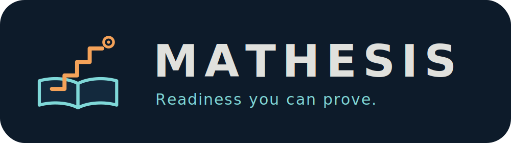
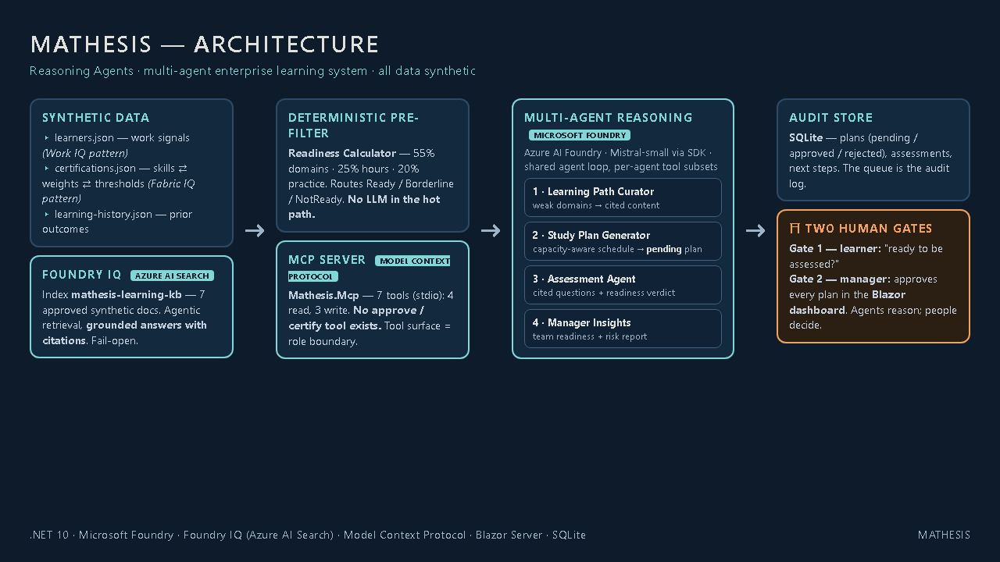
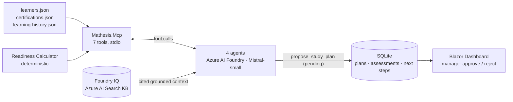
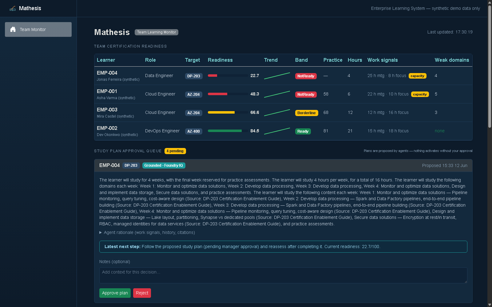
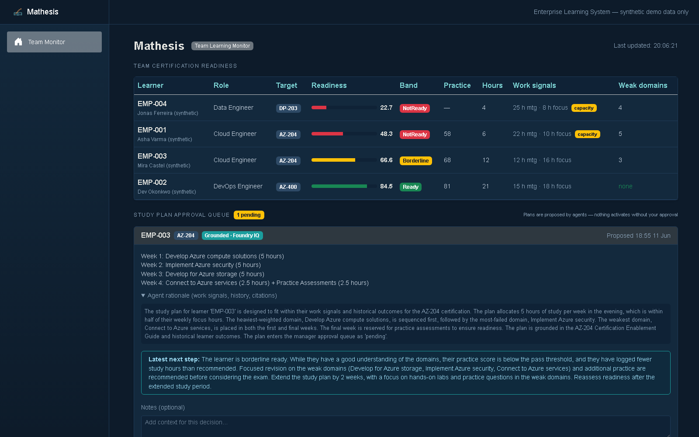
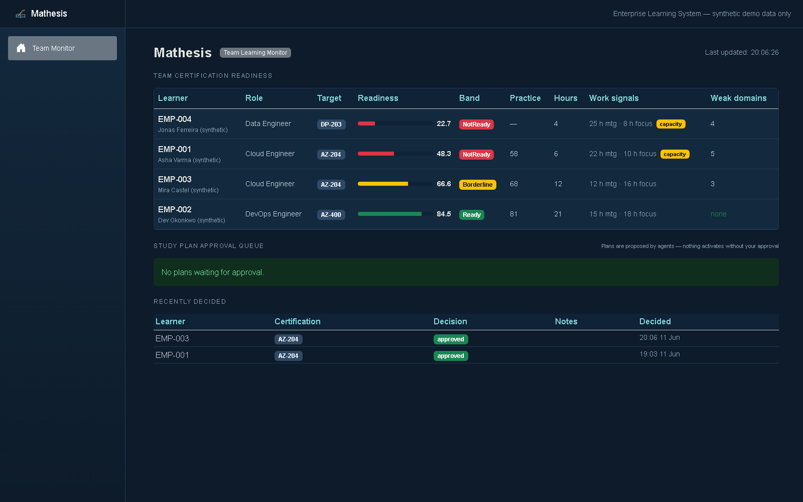
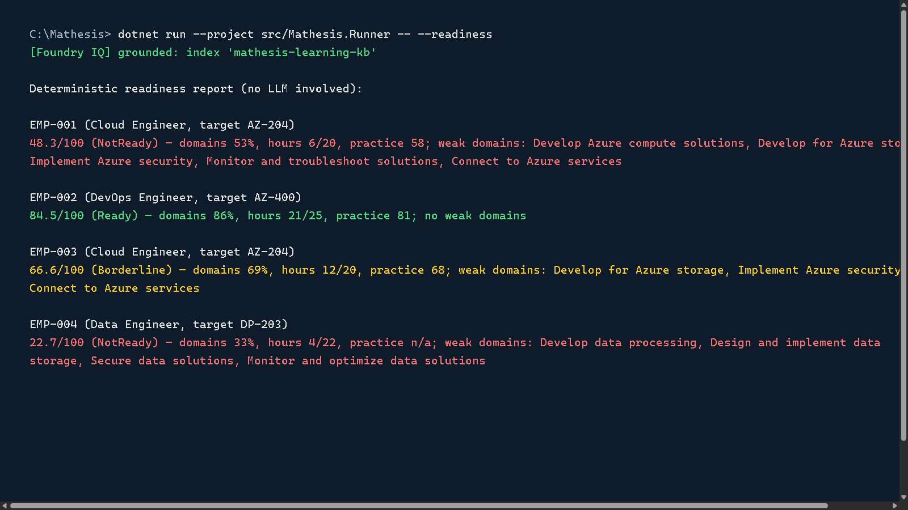
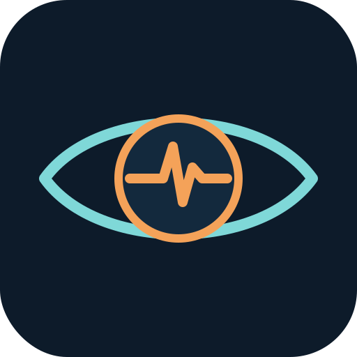
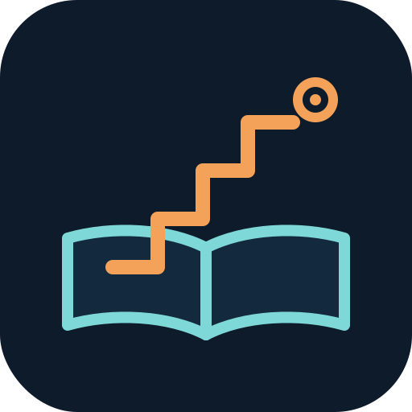

<p align="center">
  
</p>

<p align="center">
  
  
  
  
  
  
</p>

**Mathesis** (Greek: *the act of learning*) is a multi-agent enterprise learning system
that manages internal certification programmes for a team: it curates grounded learning
paths, generates capacity-aware study plans, assesses readiness with cited questions —
and stops at **two human gates**. The learner decides when to be assessed; the manager
approves every study plan. The agents reason; people decide.

Built for the [Agents League Hackathon @ AISF 2026](https://aka.ms/agentsleague/aisf) —
**Track: Reasoning Agents** — on Microsoft Foundry, with Foundry IQ grounding.

> Sibling project of [**Pronoia**](https://github.com/anjitha-mekkayil-anand/Pronoia)
> (predictive maintenance, same agent engine). Pronoia is foresight; Mathesis is
> learning. Both are built on the same conviction: AI should reason, cite, and
> recommend — humans act.

---

## Hackathon compliance map

| Submission requirement | Where Mathesis meets it |
|------------------------|-------------------------|
| Multi-agent system **aligned to the challenge scenario** | Enterprise learning system for internal team certification programmes — Learning Path Curator → Study Plan Generator → Assessment Agent → Manager Insights Agent (`src/Mathesis.Agent/MultiAgent/`) |
| **Microsoft Foundry** (UI or SDK) | Azure AI Foundry serverless deployment (Mistral-small) called via SDK — every agent reasons through Foundry |
| **Reasoning and multi-step decision-making across agents** | Deterministic readiness pre-filter routes each learner; agents hand structured findings forward; assessment loops back into planning |
| **External tools / MCP** | `Mathesis.Mcp` — a Model Context Protocol server with 7 tools (stdio); each agent receives only its role's tool subset |
| **≥1 Microsoft IQ layer** | **Foundry IQ**: Azure AI Search index `mathesis-learning-kb` — agentic retrieval over approved synthetic documents, **grounded answers with citations**. Work IQ + Fabric IQ implemented as concept patterns (below) |
| **Synthetic data and documents only** | All learners, certifications, history, and knowledge docs are fabricated (`EMP-…`/`L-…` identifiers) — see [Synthetic data](#synthetic-data-statement) |
| **Demoable + explained agent interactions** | Console narrates every hop (`[Readiness] → [Curator] → [Planner] → [Human gate] → [Assessor]`); demo video below |
| **Documentation: roles, orchestration, tools, data** | This README + `docs/plans/` |

**Demo video:** https://youtu.be/JYVCqiPeCqM *(1:18 — narration: AI voice, disclosed)*

---

## The two human gates

The official suggested architecture includes one human-in-the-loop step ("ready to be
assessed?"). Mathesis implements it — and adds a second:

1. **The learner gates the assessment.** After a study plan is proposed, the learner is
   asked whether they're ready to be assessed now. Nobody gets quizzed against their will.
2. **The manager gates the plan.** Every study plan an agent proposes lands in an
   approval queue as *pending*. There is no `approve_plan` tool — approval happens in
   the dashboard, by a person. The agents literally cannot activate their own plans.

This is the challenge's Responsible AI line — *"include human oversight in important
decisions"* — implemented as architecture, not as a disclaimer.

---

## How it works

```
learner roster + work signals          mathesis-learning-kb (Azure AI Search)
        │                                      │  Foundry IQ · cited retrieval
        ▼                                      ▼
┌─ READINESS CALCULATOR ── deterministic, no LLM ──────────────────────┐
│  55% domain self-ratings · 25% study hours · 20% practice score      │
└──────┬────────────────────────────────────────────────────────────────┘
       │ Ready ──────────────────────────────────────────┐
       │ Borderline / NotReady                           │
       ▼                                                 │
[1] LEARNING PATH CURATOR — maps weak domains to         │
    cited content (read-only tools)                      │
       ▼                                                 │
[2] STUDY PLAN GENERATOR — capacity-aware schedule       │
    from work signals + historical outcomes;             │
    plan → manager approval queue (pending)              │
       ▼                                                 │
 HUMAN GATE #1: "Ready to be assessed?" ── no ──► defer, │
       │ yes                              reassess later │
       ▼                                                 ▼
[3] ASSESSMENT AGENT — 5 cited questions on weak domains,
    readiness verdict vs pass threshold, next step
       ▼
[4] MANAGER INSIGHTS — team readiness report: who books,
    who's on track, who's capacity-constrained
       ▼
 HUMAN GATE #2: manager approves / rejects each plan (dashboard)
```

### The agents

| Agent | Tools (its entire surface) | Writes |
|-------|---------------------------|--------|
| Learning Path Curator | `get_learner_readiness`, `get_certification` | nothing — read-only |
| Study Plan Generator | `list_learners`, `get_learning_history`, `propose_study_plan` | one plan → **pending approval** |
| Assessment Agent | `get_learner_readiness`, `get_certification`, `record_assessment`, `recommend_next_step` | cited questions + next step |
| Manager Insights | `list_learners`, `get_learner_readiness`, `get_learning_history` | nothing — reports only |

**The tool surface is the role boundary.** The Curator cannot plan. The Planner cannot
assess. Nobody can approve. There is no `mark_certified`, no `approve_plan`, no
`update_rating` tool to misuse — by design, not by prompt.

### The deterministic pre-filter

An LLM call per learner per tick would be wasteful. A deterministic readiness
calculator runs first (55% weighted domain self-ratings, 25% hours vs recommended,
20% practice score) and routes:

- **Ready** → straight to assessment; Curator and Planner never run (zero wasted calls)
- **Borderline / NotReady** → full pipeline

The LLM reasons only where reasoning is needed.

---

## Microsoft IQ integration

| IQ layer | Status in Mathesis | How |
|----------|--------------------|-----|
| **Foundry IQ** | **Fully integrated** | Azure AI Search index of approved synthetic learning docs; queried per learner (certification + weak domains); agents receive a `[GROUNDED KNOWLEDGE]` block and **cite source documents** in curated paths, plan rationales, and assessment questions |
| **Work IQ** | Concept pattern (per starter-kit suggested implementation) | Synthetic work-activity signals (meeting hours, focus hours, preferred slot) drive study-window selection; planned weekly study ≤ half of focus hours; heavy-meeting learners flagged as capacity risks for the manager |
| **Fabric IQ** | Concept pattern (per starter-kit suggested implementation) | The semantic seed — certification ⇄ skills ⇄ domain weights ⇄ recommended hours ⇄ pass thresholds — modelled as the ontology agents and the readiness calculator reason over |

Grounding is **fail-open**: if Azure AI Search is unconfigured or unreachable, the
agents run ungrounded with a loud console warning — a dead retrieval layer never kills
an analysis. Status is printed on every startup:

```
[Foundry IQ] grounded: index 'mathesis-learning-kb'
```

---

## Demo output (real runs)

A NotReady learner — full chain, gate defers assessment:

```
[Readiness]     EMP-001: 48.3/100 (NotReady) — deterministic pre-filter, no LLM
[Curator]       curating learning path for weak domains: Develop Azure compute solutions, ...
[Planner]       generating capacity-aware study plan...
[Planner]       plan recorded — status: pending manager approval.
[Human gate]    non-interactive — deferring assessment for NotReady learner.
[Assessor]      deferred — learner not ready to be assessed.

Next step:   Follow the proposed study plan (pending manager approval) and reassess
             after completing it. Current readiness: 48.3/100.
```

A Ready learner — short-circuits, zero wasted agent calls:

```
[Readiness]     EMP-002: 84.5/100 (Ready) — deterministic pre-filter, no LLM
[Curator]       skipped — EMP-002 is Ready; no new content needed.
[Planner]       skipped — no plan needed for a Ready learner.
[Assessor]      generating cited questions + readiness verdict...

Next step:   Book the exam. The learner is ready.
```

The dashboard (`http://localhost:5221`) shows the team readiness table and the
**study plan approval queue** — where the manager approves or rejects what the agents
proposed.

---

## Architecture





```
src/
  Mathesis.Core/        Learner, certification, history models + roster loader
  Mathesis.Readiness/   Deterministic readiness calculator (the pre-filter)
  Mathesis.Data/        SQLite store — plans (w/ approval status), assessments, next steps
  Mathesis.Mcp/         MCP server — 7 tools, stdio transport + synthetic datasets
  Mathesis.Agent/       Agent loop, MCP client, Foundry IQ grounding + seeder, 4 agents, orchestrator
  Mathesis.Runner/      Console host — pipeline runs, --readiness, --seed-kb, --all, --team
  Mathesis.Dashboard/   Blazor Server — team readiness + manager approval queue
learning-kb/            7 synthetic knowledge documents (the Foundry IQ corpus)
docs/reference/         Official suggested-architecture diagrams (for comparison)
```

**Scenario coverage notes** (the suggested architecture allows variation, per the
challenge brief): the Engagement Agent's responsibility — choosing realistic study
windows from work signals — lives inside the Study Plan Generator, which schedules
around each learner's meeting load, focus hours, and preferred slot. Team-level
planning is served by the Manager Insights Agent, which aggregates individual
readiness into team progress, capacity constraints, and exam-risk areas.

The pipeline maps 1:1 onto the official suggested architecture
(`docs/reference/reasoning-agents-architecture.png`): their Dispatcher = our
orchestrator; their sequential sub-workflow = our Curator → Planner; their HITL step =
our gate #1; their Readiness Assessment Agent = our Assessor; their Manager Insights =
ours. We fold the Engagement Agent's scheduling concern into the Planner (work-signal
windows) and add the manager approval gate on top.

---

## Screenshots

| | |
|---|---|
|  |  |
|  |  |

---

## Safety by design

- **No agent can act on a learner's career.** No approve, no certify, no rating
  mutation — the strongest write any agent has is a *pending* proposal
- **Least privilege per agent** — each gets only its role's tools (table above)
- **Two human gates** — learner gates assessment; manager gates plans
- **Cited, grounded outputs** — Foundry IQ sources named in paths, rationales, questions
- **Deterministic pre-filter** — no LLM on the happy path; fewer calls, fewer surprises
- **Fail-open grounding with loud status** — never silent, never fatal
- **Capacity framing** — heavy meeting load is surfaced as a scheduling problem for the
  manager, not a learner failure; insights avoid exposing sensitive personal detail

## Synthetic data statement

**All data in this repository is synthetic and for demonstration only.** Learners
(`EMP-001`…), historical outcomes (`L-1001`…), names, certifications' domain
weights, and every knowledge-base document are fabricated. No real employee data, no
PII, no customer data, no real document titles. Certification IDs (AZ-204, AZ-400,
DP-203) are used as recognisable *labels*; their domain definitions here are
simplified demo blueprints, not official exam content.

---

## How to run

### Prerequisites
- .NET 10 SDK
- Azure AI Foundry resource with a deployed model (Mistral-small recommended)
- Optional: Azure AI Search (free tier) for Foundry IQ grounding

### Secrets (never in appsettings)
```bash
dotnet user-secrets set "LearningAgents:AzureFoundry:ApiKey" "<foundry-key>" --project src/Mathesis.Runner

# Optional — enables grounded, cited mode:
dotnet user-secrets set "LearningAgents:FoundryIq:SearchEndpoint" "<search-endpoint>" --project src/Mathesis.Runner
dotnet user-secrets set "LearningAgents:FoundryIq:ApiKey" "<search-admin-key>" --project src/Mathesis.Runner
```

### One-time: seed the Foundry IQ knowledge base
```bash
dotnet run --project src/Mathesis.Runner -- --seed-kb
```

### Run the pipeline
```bash
dotnet run --project src/Mathesis.Runner -- EMP-001       # one learner (interactive gate)
dotnet run --project src/Mathesis.Runner -- --all          # whole team + manager report
dotnet run --project src/Mathesis.Runner -- --team         # manager report only
dotnet run --project src/Mathesis.Runner -- --readiness    # deterministic report — no LLM, no credentials
dotnet run --project src/Mathesis.Runner -- --eval 3       # consistency evaluation: N runs per learner
```

### Dashboard (the manager gate)
```bash
dotnet run --project src/Mathesis.Dashboard --launch-profile http
# → http://localhost:5221
```

---

## Reasoning patterns used

- **Planner–Executor** — planning (Curator + Planner) is separated from evaluation
  (Assessor); the orchestrator routes between them
- **Role-based specialisation** — four agents, four disjoint responsibilities,
  enforced by tool subsets
- **Verifier** — the readiness calculator is a deterministic verifier under the
  agents, and the human gates are the final verification layer
- **Loop-back** — a not-ready assessment feeds back into the planning workflow rather
  than terminating

## Evaluation

`--eval N` runs the full pipeline N times per learner (non-interactive) and scores
consistency: stability of the deterministic readiness band, and agreement on the
direction of the LLM's next-step recommendation (book exam / follow plan /
revise-and-reassess). Latest run: **bands stable for all four learners, 100%
next-step direction agreement (8/8 runs)** — the deterministic pre-filter anchors
the pipeline, and the grounded prompts keep the LLM's judgment reproducible.

The deterministic core is also unit-tested (`tests/Mathesis.Tests`, xUnit): readiness
band boundaries, weighted domain math, unrated-domain defaults, gap detection, and
the SQLite store's approval-queue and snapshot behaviour — all on an in-memory
database, no credentials needed.

```bash
dotnet test tests/Mathesis.Tests
```

## Readiness as a time series

Every readiness check writes a snapshot to SQLite, so readiness is a trend, not a
moment: the dashboard shows a per-learner sparkline next to the score — the manager's
answer to *"is the approved plan actually working?"* (`--seed-trends` seeds a
synthetic 5-week history for demos.)

## Observability, latency, cost

- Every hop is narrated on the console; every flag, plan, assessment, and decision is
  persisted to SQLite with timestamps — the approval queue doubles as an audit log
- The LLM is never in the hot path: Ready learners cost one agent pass, not four;
  the readiness report mode costs zero LLM calls
- One Foundry IQ retrieval per learner is shared by every agent in the pass

## What's next

- Per-agent model routing (cheap model for curation, stronger for assessment) — the
  multi-agent split makes this a config change
- Engagement Agent as a scheduled process (reminder windows from work signals)
- Evaluation harness: N runs per learner, agreement scoring on bands and next steps
- Hosted Agents on Foundry Agent Service — the orchestrator boundary makes it a
  lift-and-shift
- Microsoft Learn MCP server as an additional Curator tool — real learning paths
  alongside the internal KB

---

<p align="center">
  
  &nbsp;&nbsp;&nbsp;&nbsp;
  
</p>
<p align="center"><i>Pronoia watches machines. Mathesis grows people.<br/>
Same engine, same conviction: AI should reason, cite, and recommend — humans act.</i></p>

## Design decisions

- **Human approval gates over autonomous agents.** Agents analyze, reason, and recommend — but no agent has an approve tool. A learning plan activates only through the manager gate. This is a capability boundary, not a policy: the unsafe action is structurally impossible, not merely discouraged.
- **Reused the Pronoia reasoning engine.** The overnight domain pivot (predictive maintenance → enterprise learning) was possible because the agent engine was built domain-agnostic — the pivot changed prompts, data models, and gates, not the architecture. Engines should outlive their first domain.
- **Grounded retrieval (Foundry IQ) over raw generation.** Recommendations cite retrieved organizational content. The failure mode this kills is the plausible-but-invented learning path — the most damaging kind of wrong in an enterprise system.
- **SQLite for the learning store.** Durable state with zero infrastructure at hackathon scope, behind an interface that swaps for a server database if scaled. Ops overhead deferred until the scale exists to justify it.
